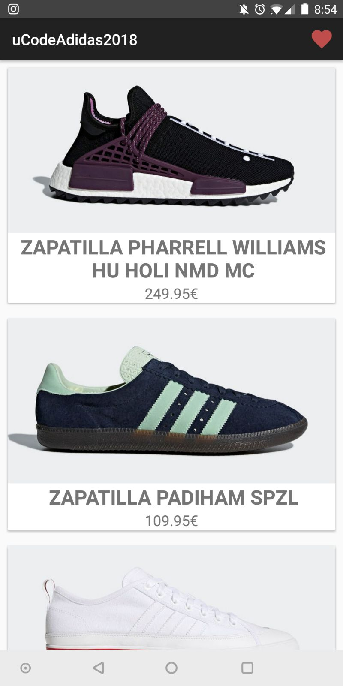
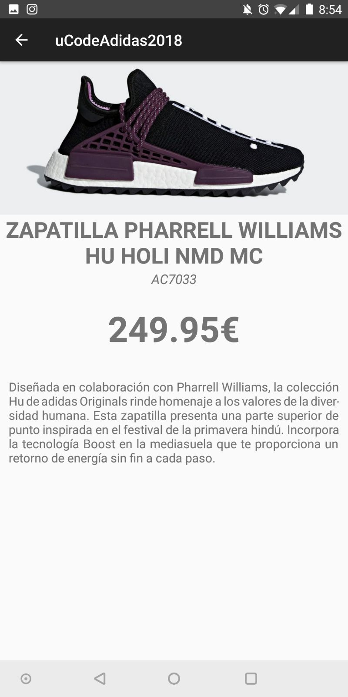
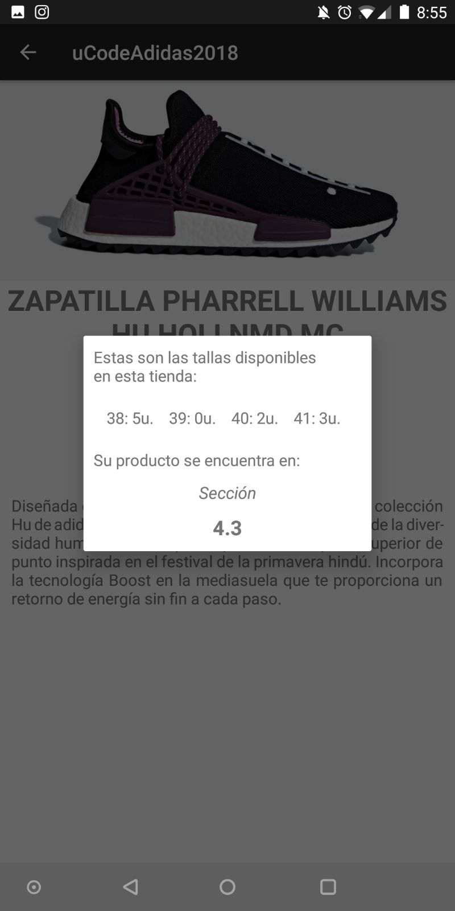

# uCode Adidas App #
_Zaragoza 2018 Edition_

This Android app was developed by four CS Students during the course of a weekend at Hackathon uCode 
Adidas 2018 (Zaragoza). It serves as a proof of concept for the team's idea of implementing NFC tags
in Adidas store to provide consumers with a quick way to consult product information in their
smartphones.

This application can be installed in devices running Android 7.0 (Nougat) with an NFC reader.

## Description ##
The applicacion features three modes of operation:

1. Shows the user a list of Adidas products retrieved from a (supposed) Adidas database and displays
global information (name, description, price) about it. In this implementation a personal Firebase 
database is used.

2. Allows a user in the entrance of an Adidas store to locate an item from the product list in the 
current store. This is done by navigating to the product info page in the app and bringing the phone
closer to a supposed NFC stand in the store. The app will then show local information about the
product (location within the store, size availability).

3. Allows a user in front of a physical product in a store to consult both global and local information
about it, as if he had found it and selected it in the product list. This is done by bringing the
phone closer to a product NFC tag.

## Screenshots ##
Product List             |  Product Detail          |Product Popup
:-------------------------:|:-------------------------:|:-------------------------:
  |   |  

## NFC Tag Format ##
The NFC tag should contain a single string written to it in NFC Data Exchange Format (NDEF).

- Product format: Pxxxxyyyyyy
- Store format: Txxxx

Where xxxx is the store id and yyyyyy is the product id.

## Development Team ##
- Roger Bosch
- Jordi García L
- Jeroni Molina
- Sergi Quevedo

License
--------
    MIT License

    Copyright (c) 2018 Jordi García Lissón

    Permission is hereby granted, free of charge, to any person obtaining a copy
    of this software and associated documentation files (the "Software"), to deal
    in the Software without restriction, including without limitation the rights
    to use, copy, modify, merge, publish, distribute, sublicense, and/or sell
    copies of the Software, and to permit persons to whom the Software is
    furnished to do so, subject to the following conditions:

    The above copyright notice and this permission notice shall be included in all
    copies or substantial portions of the Software.

    THE SOFTWARE IS PROVIDED "AS IS", WITHOUT WARRANTY OF ANY KIND, EXPRESS OR
    IMPLIED, INCLUDING BUT NOT LIMITED TO THE WARRANTIES OF MERCHANTABILITY,
    FITNESS FOR A PARTICULAR PURPOSE AND NONINFRINGEMENT. IN NO EVENT SHALL THE
    AUTHORS OR COPYRIGHT HOLDERS BE LIABLE FOR ANY CLAIM, DAMAGES OR OTHER
    LIABILITY, WHETHER IN AN ACTION OF CONTRACT, TORT OR OTHERWISE, ARISING FROM,
    OUT OF OR IN CONNECTION WITH THE SOFTWARE OR THE USE OR OTHER DEALINGS IN THE
    SOFTWARE.

Written by Jordi García L, March 2018

